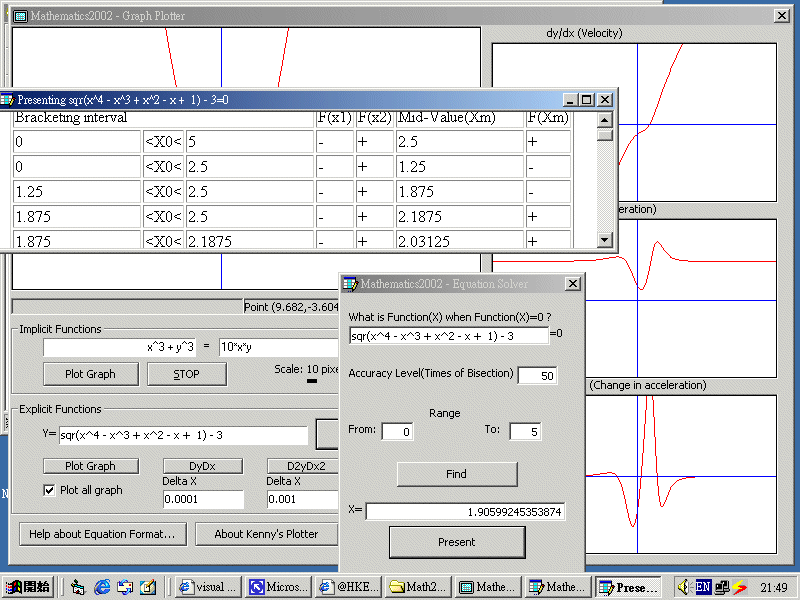



## A little bit more than mathematics and VB\.\.\.also a good demonstration of MS Script Control

### Description

Yes, it's a newer graph plotter.<b> It's

much more easier to use than that in XP Power Toys. </b>You

can just type in the equation(both implicit or explicit) in X,Y form in the text

box, and click "Plot Graph". You can also see the graph f'(x), f''(x),

f'''(x) of an explicit function. See it yourself.

 
### More Info
 

             |
---                |---
**Submitted On**   |
**By**             |[Kenny Lai, Lai Ho Wa](https://github.com/Planet-Source-Code/PSCIndex/blob/master/ByAuthor/kenny-lai-lai-ho-wa.md)
**Level**          |Advanced
**User Rating**    |4.6 (55 globes from 12 users)
**Compatibility**  |VB 6\.0, VB Script
**Category**       |[Math/ Dates](https://github.com/Planet-Source-Code/PSCIndex/blob/master/ByCategory/math-dates__1-37.md)
**World**          |[Visual Basic](https://github.com/Planet-Source-Code/PSCIndex/blob/master/ByWorld/visual-basic.md)
**Archive File**   |

### Source Code

Yes, it's a newer graph plotter.<b> It's
much more easier to use than that in XP Power Toys. </b>You
can just type in the equation(both implicit or explicit) in X,Y form in the text
box, and click "Plot Graph". You can also see the graph f'(x), f''(x),
f'''(x) of an explicit function. See it yourself.

 
 Again, this is an updated version of my previous version of graph plotter. Now it can plot graph of dy/dx, d2y/dx2, d3y/dx3. With the combination of my previous equation solver by bisection method(that can solve almost all equations), the new product, "Mathematics 2002" is a very nice mathematics tools that help you to solve most algebra and calculus problems. See it yourself. 
 
Download: 
<a href="http://pcseries.sourceforge.net/pscode/Math2002.zip">http://pcseries.sourceforge.net/pscode/Math2002.zip</a>

